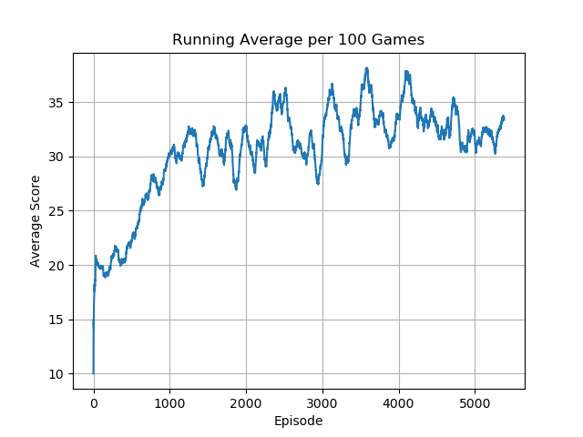

# Deep Q Network

## Overview

🚧 🛠️👷‍♀️ 🛑 Under construction...

## Setup

### Required Dependencies

Install the required dependencies using the following command:

```bash
pip install -r requirements.txt
```

### Running the Algorithm

You can run the algorithm on any supported Gymnasium environment. For example:

```bash
python main.py --env 'LunarLander-v2'
```

---

<table>
    <tr>
        <td>
            <p><b>Adventure</b></p>
            
        </td>
        <td>
            <p><b>AirRaid</b></p>
            
        </td>
        <td>
            <p><b>Alien</b></p>
            
        </td>
    </tr>
    <tr>
        <td>
            
        </td>
        <td>
            
        </td>
        <td>
            
        </td>
    </tr>
</table>
<table>
    <tr>
        <td>
            <p><b>Amidar</b></p>
            
        </td>
        <td>
            <p><b>Asteroids</b></p>
            
        </td>
        <td>
            <p><b>Assault</b></p>
            
        </td>
    </tr>
    <tr>
        <td>
            
        </td>
        <td>
            
        </td>
        <td>
            
        </td>
    </tr>
</table>
<table>
    <tr>
        <td>
            <p><b>Asterix</b></p>
            
        </td>
        <td>
            <p><b>Atlantis</b></p>
            
        </td>
        <td>
            <p><b>BankHeist</b></p>
            
        </td>
    </tr>
    <tr>
        <td>
            
        </td>
        <td>
            
        </td>
        <td>
            
        </td>
    </tr>
</table>
<table>
    <tr>
        <td>
            <p><b>BattleZone</b></p>
            
        </td>
        <td>
            <p><b>Berzerk</b></p>
            
        </td>
        <td>
            <p><b>Bowling</b></p>
            
        </td>
    </tr>
    <tr>
        <td>
            
        </td>
        <td>
            
        </td>
        <td>
            
        </td>
    </tr>
</table>
<table>
    <tr>
        <td>
            <p><b>Boxing</b></p>
            
        </td>
        <td>
            <p><b>Breakout</b></p>
            
        </td>
        <td>
            <p><b>Carnival</b></p>
            
        </td>
    </tr>
    <tr>
        <td>
            
        </td>
        <td>
            
        </td>
        <td>
            
        </td>
    </tr>
</table> 
<table>
    <tr>
        <td>
            <p><b>Centipede</b></p>
            
        </td>
        <td>
            <p><b>ChopperCommand</b></p>
            
        </td>
        <td>
            <p><b>CrazyClimber</b></p>
            
        </td>
    </tr>
    <tr>
        <td>
            
        </td>
        <td>
            
        </td>
        <td>
            
        </td>
    </tr>
</table> 
<table>
    <tr>
        <td>
            <p><b>Defender</b></p>
            
        </td>
        <td>
            <p><b>DemonAttack</b></p>
            
        </td>
        <td>
            <p><b>DoubleDunk</b></p>
            
        </td>
    </tr>
    <tr>
        <td>
            
        </td>
        <td>
            
        </td>
        <td>
            
        </td>
    </tr>
</table> 
---

## Acknowledgements

Special thanks to Phil Tabor, an excellent teacher! I highly recommend his [Youtube channel](https://www.youtube.com/machinelearningwithphil).
