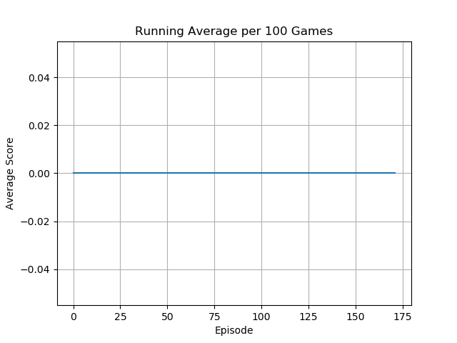
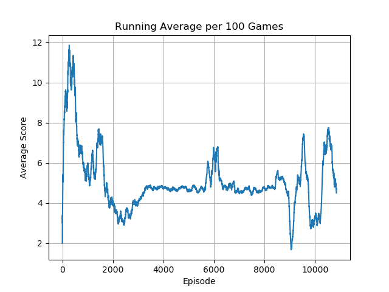
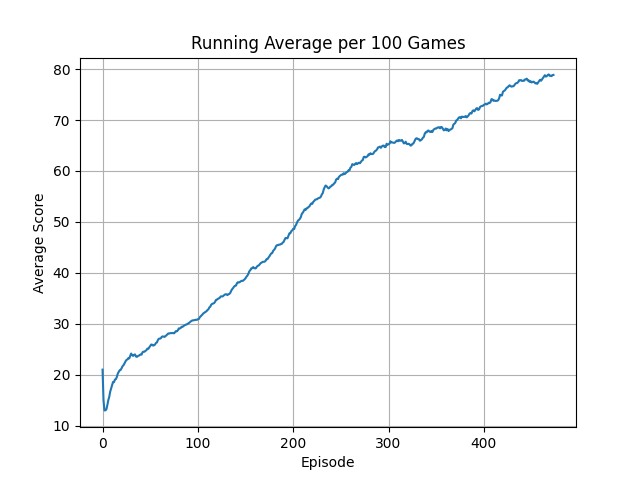

# Deep Q Network

## Overview

🚧 🛠️👷‍♀️ 🛑 Under construction...

## Setup

### Required Dependencies

Install the required dependencies using the following command:

```bash
pip install -r requirements.txt
```

### Running the Algorithm

You can run the algorithm on any supported Gymnasium environment. For example:

```bash
python main.py --env 'LunarLander-v2'
```

---

<table>
    <tr>
        <td>
            <p><b>Adventure</b></p>
            
        </td>
        <td>
            <p><b>AirRaid</b></p>
            
        </td>
        <td>
            <p><b>Alien</b></p>
            
        </td>
    </tr>
    <tr>
        <td>
            
        </td>
        <td>
            
        </td>
        <td>
            
        </td>
    </tr>
</table>
<table>
    <tr>
        <td>
            <p><b>Amidar</b></p>
            
        </td>
        <td>
            <p><b>Asteroids</b></p>
            
        </td>
        <td>
            <p><b>Assault</b></p>
            
        </td>
    </tr>
    <tr>
        <td>
            
        </td>
        <td>
            
        </td>
        <td>
            
        </td>
    </tr>
</table>
<table>
    <tr>
        <td>
            <p><b>Asterix</b></p>
            
        </td>
        <!--<td>
            <p><b>Centipede-v5</b></p>
            
        </td>
        <td>
            <p><b>DonkeyKong-v5</b></p>
            
        </td>-->
    </tr>
    <tr>
        <td>
            
        </td>
        <!--<td>
            
        </td>
        <td>
            
        </td>-->
    </tr>
</table>
<!--<table>
    <tr>
        <td>
            <p><b>DoubleDunk-v5</b></p>
            
        </td>
        <td>
            <p><b>Frogger-v5</b></p>
            
        </td>
        <td>
            <p><b>KungFuMaster-v5</b></p>
            
        </td>
        <td>
            <p><b>MarioBros-v5</b></p>
            
        </td>
    </tr>
    <tr>
    <td>
            
        </td>
        <td>
            
        </td>
        <td>
            
        </td>
        <td>
            
        </td>
    </tr>
</table>  -->
<table>
    <tr>
        <td>
            <p><b>MsPacman</b></p>
            
        </td>
        <!--<td>
            <p><b>SpaceInvaders-v5</b></p>
            
        </td>
        <td>
            <p><b>Tetris-v5</b></p>
            
        </td>-->
    </tr>
    <tr>
        <td>
            
        </td>
        <!--<td>
            
        </td>
        <td>
            
        </td> -->
    </tr>
</table>

---

## Acknowledgements

Special thanks to Phil Tabor, an excellent teacher! I highly recommend his [Youtube channel](https://www.youtube.com/machinelearningwithphil).
