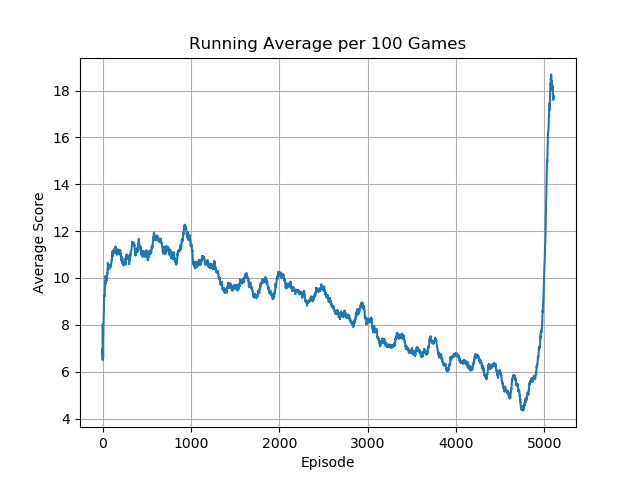
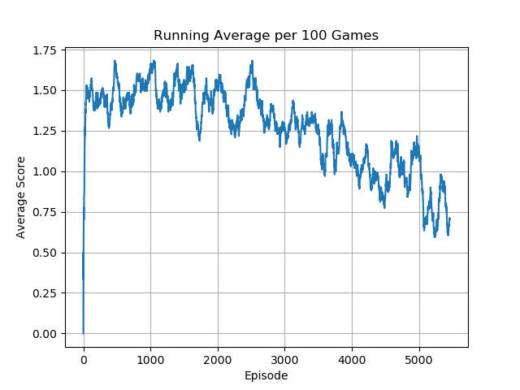
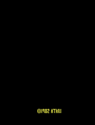
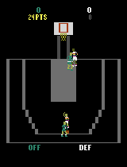

# Deep Q Network

## Table of Contents

1. [Overview](#overview)
2. [Setup](#setup)
3. [Results](#results)
4. [Analysis](#analysis)

## Overview

This repository contains an implementation of the original [Deep Q-Network (DQN)](https://arxiv.org/pdf/1312.5602) learning algorithm using PyTorch. DQN introduced a significant advancement in reinforcement learning by combining Q-learning with deep neural networks to handle high-dimensional state spaces, such as those encountered in video games.

The core idea of DQN is to approximate the Q-value function, which estimates the expected future rewards for taking a certain action in a given state. To achieve this, DQN employs a neural network to predict Q-values and uses experience replay to break the correlation between consecutive experiences, improving training stability. Additionally, it uses a separate target network to compute the target Q-values, which are periodically updated to stabilize training by providing a more consistent target.

The implementation is tested against various Atari environments from the Gymnasium library, which are designed for vectorized, efficient processing. A custom preprocessing wrapper is included to prepare the frames, in line with the approach described in the original DQN paper, including techniques like frame stacking and reward clipping. For the best results, using the 'NoFrameskip' versions of these environments is recommended.

## Setup

### Required Dependencies

It's recommended to use a Conda environment to manage dependencies and avoid conflicts. You can create and activate a new Conda environment with the following commands:

```bash
conda create -n dqn_env python=3.11
conda activate dqn_env
```

After activating the environment, install the required dependencies using:

```bash
pip install -r requirements.txt
```

### Running the Algorithm

You can run the algorithm on any supported Gymnasium environment with a discrete action space using the following command:

```bash
python main.py --env 'MsPacmanNoFrameskip-v4'
```

#### Command-Line Arguments

- **Environment Selection**: Use `-e` or `--env` to specify the Gymnasium environment. The default is `None`, so you must specify an environment.
  
  Example:

  ```bash
  python main.py --env 'PongNoFrameskip-v4'
  ```

- **Number of Learning Steps**: Use `--n_steps` to define how many training steps the agent should undergo. The default is 100,000 steps.

  Example:

  ```bash
  python main.py --env 'BreakoutNoFrameskip-v4' --n_steps 200000
  ```

- **Parallel Environments**: Use `--n_envs` to specify the number of parallel environments to run during training. The default is 32 environments, optimizing the training process.

  Example:

  ```bash
  python main.py --env 'AsterixNoFrameskip-v4' --n_envs 16
  ```

- **Continue Training**: Use `--continue_training` to determine whether to continue training from saved weights. The default is `True`, allowing you to resume training from where you left off.

  Example:

  ```bash
  python main.py --env 'AsteroidsNoFrameskip-v4' --continue_training False
  ```

Using a Conda environment along with these flexible command-line options will help you efficiently manage your dependencies and customize the training process for your specific needs.

## Results

Each agent in this implementation is trained for 100,000 steps. In addition to the primary metrics tracked during training, I also began monitoring the average Q-values for a set of fixed initial states. This additional data is displayed in some of the learning plots and provides further context for evaluating the performance of the Double DQN algorithm. Tracking these average Q-values helps in understanding how the learned policy values specific states over time and can offer valuable insights into the stability and quality of the learned Q-function. Although this information only appears in select plots, it complements the overall analysis by highlighting how valuable the agent considers a consistent set of scenarios throughout training, especially since early states should (usually) be fairly valuable.


<table>
    <tr>
        <td>
            <p><b>Adventure</b></p>
            
        </td>
        <td>
            <p><b>AirRaid</b></p>
            
        </td>
        <td>
            <p><b>Alien</b></p>
            
        </td>
    </tr>
    <tr>
        <td>
            
        </td>
        <td>
            
        </td>
        <td>
            
        </td>
    </tr>
</table>
<table>
    <tr>
        <td>
            <p><b>Amidar</b></p>
            
        </td>
        <td>
            <p><b>Asteroids</b></p>
            
        </td>
        <td>
            <p><b>Assault</b></p>
            
        </td>
    </tr>
    <tr>
        <td>
            
        </td>
        <td>
            
        </td>
        <td>
            
        </td>
    </tr>
</table>
<table>
    <tr>
        <td>
            <p><b>Asterix</b></p>
            
        </td>
        <td>
            <p><b>Atlantis</b></p>
            
        </td>
        <td>
            <p><b>BankHeist</b></p>
            
        </td>
    </tr>
    <tr>
        <td>
            
        </td>
        <td>
            
        </td>
        <td>
            
        </td>
    </tr>
</table>
<table>
    <tr>
        <td>
            <p><b>BattleZone</b></p>
            
        </td>
        <td>
            <p><b>Berzerk</b></p>
            
        </td>
        <td>
            <p><b>Bowling</b></p>
            
        </td>
    </tr>
    <tr>
        <td>
            
        </td>
        <td>
            
        </td>
        <td>
            
        </td>
    </tr>
</table>
<table>
    <tr>
        <td>
            <p><b>Boxing</b></p>
            
        </td>
        <td>
            <p><b>Breakout</b></p>
            
        </td>
        <td>
            <p><b>Carnival</b></p>
            
        </td>
    </tr>
    <tr>
        <td>
            
        </td>
        <td>
            
        </td>
        <td>
            
        </td>
    </tr>
</table> 
<table>
    <tr>
        <td>
            <p><b>Centipede</b></p>
            
        </td>
        <td>
            <p><b>ChopperCommand</b></p>
            
        </td>
        <td>
            <p><b>CrazyClimber</b></p>
            
        </td>
    </tr>
    <tr>
        <td>
            
        </td>
        <td>
            
        </td>
        <td>
            
        </td>
    </tr>
</table> 
<table>
    <tr>
        <td>
            <p><b>Defender</b></p>
            
        </td>
        <td>
            <p><b>DemonAttack</b></p>
            
        </td>
        <td>
            <p><b>DoubleDunk</b></p>
            
        </td>
    </tr>
    <tr>
        <td>
            
        </td>
        <td>
            
        </td>
        <td>
            
        </td>
    </tr>
</table> 
<table>
    <tr>
        <td>
            <p><b>ElevatorAction</b></p>
            
        </td>
        <td>
            <p><b>Enduro</b></p>
            
        </td>
        <td>
            <p><b>FishingDerby</b></p>
            
        </td>
    </tr>
    <tr>
        <td>
            
        </td>
        <td>
            
        </td>
        <td>
            
        </td>
    </tr>
</table> 
<table>
    <tr>
        <td>
            <p><b>Freeway</b></p>
            
        </td>
        <td>
            <p><b>Frostbite</b></p>
            
        </td>
        <td>
            <p><b>Gopher</b></p>
            
        </td>
    </tr>
    <tr>
        <td>
            
        </td>
        <td>
            
        </td>
        <td>
            
        </td>
    </tr>
</table> 
<table>
    <tr>
        <td>
            <p><b>Gravitar</b></p>
            
        </td>
        <td>
            <p><b>Hero</b></p>
            
        </td>
        <td>
            <p><b>IceHockey</b></p>
            
        </td>
    </tr>
    <tr>
        <td>
            
        </td>
        <td>
            
        </td>
        <td>
            
        </td>
    </tr>
</table> 
<table>
    <tr>
        <td>
            <p><b>Jamesbond</b></p>
            
        </td>
        <td>
            <p><b>JourneyEscape</b></p>
            
        </td>
        <td>
            <p><b>Kangaroo</b></p>
            
        </td>
    </tr>
    <tr>
        <td>
            
        </td>
        <td>
            
        </td>
        <td>
            
        </td>
    </tr>
</table> 
<table>
    <tr>
        <td>
            <p><b>Krull</b></p>
            
        </td>
        <td>
            <p><b>KungFuMaster</b></p>
            
        </td>
        <td>
            <p><b>MontezumaRevenge</b></p>
            
        </td>
    </tr>
    <tr>
        <td>
            
        </td>
        <td>
            
        </td>
        <td>
            
        </td>
    </tr>
</table> 
<table>
    <tr>
        <td>
            <p><b>MsPacman</b></p>
            
        </td>
        <td>
            <p><b>NameThisGame</b></p>
            
        </td>
        <td>
            <p><b>Phoenix</b></p>
            
        </td>
    </tr>
    <tr>
        <td>
            
        </td>
        <td>
            
        </td>
        <td>
            
        </td>
    </tr>
</table> 
<table>
    <tr>
        <td>
            <p><b>Pitfall</b></p>
            
        </td>
        <td>
            <p><b>Pong</b></p>
            
        </td>
        <td>
            <p><b>Pooyan</b></p>
            
        </td>
    </tr>
    <tr>
        <td>
            
        </td>
        <td>
            
        </td>
        <td>
            
        </td>
    </tr>
</table> 
<table>
    <tr>
        <td>
            <p><b>PrivateEye</b></p>
            
        </td>
        <td>
            <p><b>Qbert</b></p>
            
        </td>
        <td>
            <p><b>Riverraid</b></p>
            
        </td>
    </tr>
    <tr>
        <td>
            
        </td>
        <td>
            
        </td>
        <td>
            
        </td>
    </tr>
</table> 
<table>
    <tr>
        <td>
            <p><b>RoadRunner</b></p>
            
        </td>
        <td>
            <p><b>Robotank</b></p>
            
        </td>
        <td>
            <p><b>Seaquest</b></p>
            
        </td>
    </tr>
    <tr>
        <td>
            
        </td>
        <td>
            
        </td>
        <td>
            
        </td>
    </tr>
</table>
<table>
    <tr>
        <td>
            <p><b>Skiing</b></p>
            
        </td>
        <td>
            <p><b>Solaris</b></p>
            
        </td>
        <td>
            <p><b>SpaceInvaders</b></p>
            
        </td>
    </tr>
    <tr>
        <td>
            
        </td>
        <td>
            
        </td>
        <td>
            
        </td>
    </tr>
</table>
<table>
    <tr>
        <td>
            <p><b>StarGunner</b></p>
            
        </td>
        <td>
            <p><b>Tennis</b></p>
            
        </td>
        <td>
            <p><b>TimePilot</b></p>
            
        </td>
    </tr>
    <tr>
        <td>
            
        </td>
        <td>
            
        </td>
        <td>
            
        </td>
    </tr>
</table>
<table>
    <tr>
        <td>
            <p><b>Tutankham</b></p>
            
        </td>
        <td>
            <p><b>UpNDown</b></p>
            
        </td>
        <td>
            <p><b>Venture</b></p>
            
        </td>
    </tr>
    <tr>
        <td>
            
        </td>
        <td>
            
        </td>
        <td>
            
        </td>
    </tr>
</table>
<table>
    <tr>
        <td>
            <p><b>VideoPinball</b></p>
            
        </td>
        <td>
            <p><b>WizardOfWor</b></p>
            
        </td>
        <td>
            <p><b>YarsRevenge</b></p>
            
        </td>
    </tr>
    <tr>
        <td>
            
        </td>
        <td>
            
        </td>
        <td>
            
        </td>
    </tr>
</table>
<table>
    <tr>
        <td>
            <p><b>Zaxxon</b></p>
            
        </td>
    </tr>
    <tr>
        <td>
            
        </td>
    </tr>
</table>

## Analysis

The original Deep Q-Network (DQN) algorithm has shown remarkable success in many Atari environments, demonstrating its capability to handle complex and high-dimensional state spaces. However, the performance varies significantly across different environments. This section provides an analysis of why DQN may struggle with specific environments and how the choices inherent to the algorithm and environment setups contribute to these challenges.

### Environments with Poor Performance

1. **Adventure**: The agent in Adventure often fails to start the game altogether. This issue is likely due to the sparse and delayed reward signals in the environment. Adventure has complex, non-obvious goals and requires exploration and long-term planning, which DQN, with its reliance on experience replay and Q-value approximation, might struggle to handle effectively without more sophisticated exploration strategies.

2. **Bank Heist**: The performance in Bank Heist can be poor due to its requirement for precise control and timing. DQN’s discrete action space and relatively simple neural network architecture might not capture the fine-grained control needed to succeed in this environment, where precise maneuvers are crucial.

3. **Bowling**: The agent in Bowling frequently ends up with gutter balls, indicating a problem with accurately predicting the outcomes of actions in the environment. This could be due to the challenge in generalizing from the sparse rewards and the high variance in ball trajectories, which DQN’s Q-value approximation struggles to handle.

4. **Double Dunk**: In Double Dunk, the agent often fails to score effectively. This environment requires complex coordination and rapid adjustments based on opponent actions. DQN may not generalize well in environments with fast-paced dynamics and opponent strategies, leading to suboptimal performance.

5. **Elevator Action**: Poor performance in Elevator Action suggests difficulties with the environment's discrete action space and timing constraints. The algorithm may struggle with the precise timing required to move between floors and interact with enemies, resulting in inefficient navigation.

6. **Ice Hockey**: The agent’s poor performance in Ice Hockey can be attributed to the environment’s requirement for real-time decision-making and continuous control. DQN’s discrete action space and the challenge of approximating the Q-values in a high-speed, dynamic environment may lead to ineffective policies.

7. **Kangaroo**: The agent’s tendency to run into walls in Kangaroo reflects DQN’s difficulty with navigation and spatial awareness in environments where obstacle avoidance and precise movement are crucial. The algorithm may not be effective in learning the complex navigation required.

8. **Montezuma Revenge**: One of the most notorious environments for DQN, Montezuma Revenge, poses a challenge due to its sparse rewards and complex, maze-like structure. The agent often gets stuck at the opening stage because DQN struggles with long-term dependencies and exploration in environments where rewards are infrequent and delayed.

9. **Pitfall**: The agent rarely makes the necessary jumps in Pitfall, highlighting issues with learning action sequences and timing. DQN’s performance may suffer in environments that require precise, sequential actions over a longer duration.

10. **Skiing**: In Skiing, the agent often drifts off course into trees, indicating problems with continuous control and maintaining a stable trajectory. DQN’s discrete action space may not effectively manage the nuanced adjustments needed for navigation in such environments.

11. **Tennis**: The agent’s difficulty in serving the ball in Tennis shows limitations in handling environments that require complex, continuous actions and interactions with opponents. The discrete action space of DQN may not capture the subtleties of gameplay.

12. **Video Pinball**: Problems with releasing the ball to start the game suggest difficulties with the game’s setup and initial states. DQN may struggle with the precise control required to interact with the game’s mechanics effectively.

13. **Zaxxon**: The agent’s tendency to run into walls in Zaxxon reflects issues with spatial awareness and obstacle avoidance. The complexity of the 3D perspective and the requirement for precise control can overwhelm DQN’s Q-value approximation capabilities.

### Conclusion

The performance issues observed in these environments can be attributed to several factors inherent in the DQN algorithm:

- **Sparse and Delayed Rewards**: Environments like Montezuma Revenge and Adventure, where rewards are infrequent or delayed, present challenges for DQN, which relies on experience replay and approximating Q-values. These issues make it difficult for DQN to effectively learn from its experiences.

- **Precision and Timing**: Environments requiring precise control (e.g., Bank Heist and Bowling) or complex action sequences (e.g., Pitfall) can expose limitations in DQN’s ability to generalize and manage high-dimensional action spaces.

- **Dynamic and Continuous Control**: Environments like Skiing and Tennis, which demand continuous control and rapid adjustments, are challenging for DQN due to its discrete action space and reliance on Q-value approximations.

- **Navigation and Spatial Awareness**: Complex navigation tasks (e.g., Kangaroo and Zaxxon) highlight difficulties with obstacle avoidance and spatial understanding, which can be challenging for DQN’s neural network architecture and experience replay mechanism.

Overall, while DQN represents a significant advancement in reinforcement learning, its performance can be limited by its inherent algorithmic choices and the specific demands of different environments. Addressing these challenges may require more sophisticated approaches, such as those introduced in subsequent algorithms like [Double DQN](https://github.com/naivoder/DDQN) or other variants that improve on DQN’s limitations like the introduction of [Recurrent Neural Networks](https://cs229.stanford.edu/proj2016/report/ChenYingLaird-DeepQLearningWithRecurrentNeuralNetwords-report.pdf) for learning temporal relationships between states.

## Acknowledgements

Special thanks to Phil Tabor, an excellent teacher! I highly recommend his [Youtube channel](https://www.youtube.com/machinelearningwithphil).
