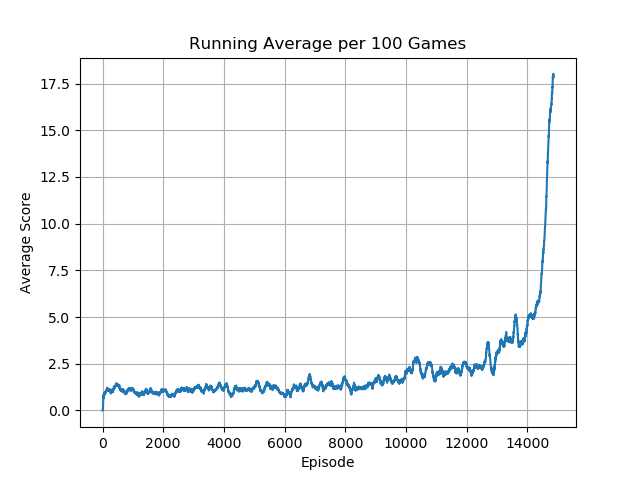

# Deep Q Network

## Overview

🚧 🛠️👷‍♀️ 🛑 Under construction...

## Setup

### Required Dependencies

Install the required dependencies using the following command:

```bash
pip install -r requirements.txt
```

### Running the Algorithm

You can run the algorithm on any supported Gymnasium environment. For example:

```bash
python main.py --env 'LunarLander-v2'
```

---

<table>
    <tr>
        <td>
            <p><b>Adventure</b></p>
            
        </td>
        <td>
            <p><b>AirRaid</b></p>
            
        </td>
        <td>
            <p><b>Alien</b></p>
            
        </td>
    </tr>
    <tr>
        <td>
            
        </td>
        <td>
            
        </td>
        <td>
            
        </td>
    </tr>
</table>
<table>
    <tr>
        <td>
            <p><b>Amidar</b></p>
            
        </td>
        <td>
            <p><b>Asteroids</b></p>
            
        </td>
        <td>
            <p><b>Assault</b></p>
            
        </td>
    </tr>
    <tr>
        <td>
            
        </td>
        <td>
            
        </td>
        <td>
            
        </td>
    </tr>
</table>
<table>
    <tr>
        <td>
            <p><b>Asterix</b></p>
            
        </td>
        <td>
            <p><b>Atlantis</b></p>
            
        </td>
        <td>
            <p><b>BankHeist</b></p>
            
        </td>
    </tr>
    <tr>
        <td>
            
        </td>
        <td>
            
        </td>
        <td>
            
        </td>
    </tr>
</table>
<table>
    <tr>
        <td>
            <p><b>BattleZone</b></p>
            
        </td>
        <td>
            <p><b>Berzerk</b></p>
            
        </td>
        <td>
            <p><b>Bowling</b></p>
            
        </td>
    </tr>
    <tr>
        <td>
            
        </td>
        <td>
            
        </td>
        <td>
            
        </td>
    </tr>
</table>
<table>
    <tr>
        <td>
            <p><b>Boxing</b></p>
            
        </td>
        <td>
            <p><b>Breakout</b></p>
            
        </td>
        <td>
            <p><b>Carnival</b></p>
            
        </td>
    </tr>
    <tr>
        <td>
            
        </td>
        <td>
            
        </td>
        <td>
            
        </td>
    </tr>
</table> 
<table>
    <tr>
        <td>
            <p><b>Centipede</b></p>
            
        </td>
        <td>
            <p><b>ChopperCommand</b></p>
            
        </td>
        <td>
            <p><b>CrazyClimber</b></p>
            
        </td>
    </tr>
    <tr>
        <td>
            
        </td>
        <td>
            
        </td>
        <td>
            
        </td>
    </tr>
</table> 
<table>
    <tr>
        <td>
            <p><b>Defender</b></p>
            
        </td>
        <td>
            <p><b>DemonAttack</b></p>
            
        </td>
        <td>
            <p><b>DoubleDunk</b></p>
            
        </td>
    </tr>
    <tr>
        <td>
            
        </td>
        <td>
            
        </td>
        <td>
            
        </td>
    </tr>
</table> 
<table>
    <tr>
        <td>
            <p><b>ElevatorAction</b></p>
            
        </td>
        <td>
            <p><b>Enduro</b></p>
            
        </td>
        <td>
            <p><b>FishingDerby</b></p>
            
        </td>
    </tr>
    <tr>
        <td>
            
        </td>
        <td>
            
        </td>
        <td>
            
        </td>
    </tr>
</table> 
<table>
    <tr>
        <td>
            <p><b>Freeway</b></p>
            
        </td>
        <td>
            <p><b>Frostbite</b></p>
            
        </td>
        <td>
            <p><b>Gopher</b></p>
            
        </td>
    </tr>
    <tr>
        <td>
            
        </td>
        <td>
            
        </td>
        <td>
            
        </td>
    </tr>
</table> 
<table>
    <tr>
        <td>
            <p><b>Gravitar</b></p>
            
        </td>
        <td>
            <p><b>Hero</b></p>
            
        </td>
        <td>
            <p><b>IceHockey</b></p>
            
        </td>
    </tr>
    <tr>
        <td>
            
        </td>
        <td>
            
        </td>
        <td>
            
        </td>
    </tr>
</table> 
<table>
    <tr>
        <td>
            <p><b>Jamesbond</b></p>
            
        </td>
        <td>
            <p><b>JourneyEscape</b></p>
            
        </td>
        <td>
            <p><b>Kangaroo</b></p>
            
        </td>
    </tr>
    <tr>
        <td>
            
        </td>
        <td>
            
        </td>
        <td>
            
        </td>
    </tr>
</table> 
<table>
    <tr>
        <td>
            <p><b>Krull</b></p>
            
        </td>
        <td>
            <p><b>KungFuMaster</b></p>
            
        </td>
        <td>
            <p><b>MontezumaRevenge</b></p>
            
        </td>
    </tr>
    <tr>
        <td>
            
        </td>
        <td>
            
        </td>
        <td>
            
        </td>
    </tr>
</table> 
<table>
    <tr>
        <td>
            <p><b>MsPacman</b></p>
            
        </td>
        <td>
            <p><b>NameThisGame</b></p>
            
        </td>
        <td>
            <p><b>Phoenix</b></p>
            
        </td>
    </tr>
    <tr>
        <td>
            
        </td>
        <td>
            
        </td>
        <td>
            
        </td>
    </tr>
</table> 
<table>
    <tr>
        <td>
            <p><b>Pitfall</b></p>
            
        </td>
        <td>
            <p><b>Pong</b></p>
            
        </td>
        <td>
            <p><b>Pooyan</b></p>
            
        </td>
    </tr>
    <tr>
        <td>
            
        </td>
        <td>
            
        </td>
        <td>
            
        </td>
    </tr>
</table> 
<table>
    <tr>
        <td>
            <p><b>PrivateEye</b></p>
            
        </td>
        <td>
            <p><b>Qbert</b></p>
            
        </td>
        <td>
            <p><b>Riverraid</b></p>
            
        </td>
    </tr>
    <tr>
        <td>
            
        </td>
        <td>
            
        </td>
        <td>
            
        </td>
    </tr>
</table> 
<table>
    <tr>
        <td>
            <p><b>RoadRunner</b></p>
            
        </td>
        <!--<td>
            <p><b>Qbert</b></p>
            
        </td>
        <td>
            <p><b>Riverraid</b></p>
            
        </td>-->
    </tr>
    <tr>
        <td>
            
        </td>
        <!--<td>
            
        </td>
        <td>
            
        </td>-->
    </tr>
</table>

---

## Acknowledgements

Special thanks to Phil Tabor, an excellent teacher! I highly recommend his [Youtube channel](https://www.youtube.com/machinelearningwithphil).
